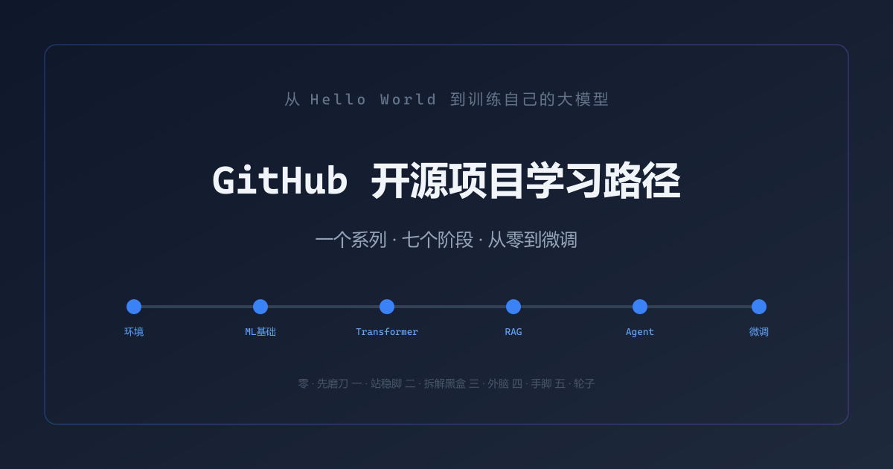

<picture>
  <source media="(prefers-color-scheme: dark)" srcset="output/covers/cover_series.png">
  
</picture>

<p align="center">
  <b>从零搭建大模型工程师技能树的 7 个实战 Notebook</b><br>
  环境搭建 → 机器学习 → Transformer → RAG → Agent → 微调 → 多模态
</p>

<p align="center">
  
  
  
</p>

---

## 📖 简介

这是一套面向 **有 Python 基础但无深度学习/大模型经验** 的学习者的实战教程。整个系列按阶段推进，每篇文章配合一个可运行的 Jupyter Notebook，从搭环境开始，逐步走到微调 7B 模型。

**目标读者**：有 Python 基础、想做 AI/大模型方向、但不知道从哪开始的在校学生或转行者。

## 📚 内容导航

| Notebook | 阶段 | 核心内容 | 需要 GPU？ |
|----------|------|---------|-----------|
| [00-先磨刀](notebooks/00_先磨刀_30分钟搭好AI学习环境.ipynb) | 环境准备 | 装Python、Ollama、d2l-zh 克隆、VS Code 配置 | 否 |
| [01-站稳脚](notebooks/01_站稳脚_用Scikit-learn跑通Pipeline.ipynb) | 机器学习基础 | Scikit-learn Pipeline、特征工程、分类器评估 | 否 |
| [02-拆解黑盒](notebooks/02_拆解黑盒_从d2l-zh到nanoGPT.ipynb) | 深度学习 & Transformer | PyTorch、d2l-zh 核心章节、注意力机制、nanoGPT | 推荐 |
| [03-接上外脑](notebooks/03_接上外脑_从零搭建RAG系统.ipynb) | RAG | 向量化、向量数据库、检索+生成、RAG 评测 | 否 |
| [04-赋予手脚](notebooks/04_赋予手脚_从FunctionCalling到Multi-Agent.ipynb) | Agent | Function Calling、三种 Agent 写法、Multi-Agent 实战 | 否 |
| [05-造轮子](notebooks/05_造自己的轮子_LLaMA-Factory微调一条龙.ipynb) | 微调 | LoRA/QLoRA、LLaMA-Factory、评测、量化、部署 | **需要** |
| [06-走出文本](notebooks/06_走出文本_VLM与图像生成.ipynb) | 多模态（选学） | VLM 或 图像生成入门 | 选学 |

## 🚀 快速开始

```bash
# 1. 克隆仓库
git clone https://github.com/ASPIRINH/hands-on-llm.git
cd hands-on-llm

# 2. 安装依赖
pip install -r requirements.txt

# 3. 启动
jupyter notebook
```

> 详细的环境搭建步骤见 [第零篇 Notebook](notebooks/00_先磨刀_30分钟搭好AI学习环境.ipynb)。

## 🧭 学习路径

```
第零阶段  环境搭建 ─── 一劳永逸的准备
    ↓
阶段一    机器学习 Pipeline ─── Scikit-learn 实战
    ↓
阶段二    Transformer ─── d2l-zh + nanoGPT
    ↓
阶段三    RAG ─── 给模型接上外部知识
    ↓
阶段四    Agent ─── 让模型替你干活
    ↓
阶段五    微调 ─── LLaMA-Factory 一条龙
    ↓
扩展      多模态（选学）
```

建议按编号顺序学习。每篇 Notebook 可独立运行，但阶段之间有知识递进关系。

## 📝 配套文章

每个 Notebook 均配有完整文章（`output/` 目录），包含原理讲解、代码解读和常见问题。文章与 Notebook 配合使用：**先读文章理解思路，再跑 Notebook 动手实践**。

| 阶段 | 文章 | Notebook |
|------|------|----------|
| 零：环境搭建 | [article_01_preparation.md](output/article_01_preparation.md) | [00-先磨刀](notebooks/00_先磨刀_30分钟搭好AI学习环境.ipynb) |
| 一：ML Pipeline | [article_02_foundation.md](output/article_02_foundation.md) | [01-站稳脚](notebooks/01_站稳脚_用Scikit-learn跑通Pipeline.ipynb) |
| 二：Transformer | [article_03_deep_learning.md](output/article_03_deep_learning.md) | [02-拆解黑盒](notebooks/02_拆解黑盒_从d2l-zh到nanoGPT.ipynb) |
| 三：RAG | [article_04_rag.md](output/article_04_rag.md) | [03-接上外脑](notebooks/03_接上外脑_从零搭建RAG系统.ipynb) |
| 四：Agent | [article_05_agent.md](output/article_05_agent.md) | [04-赋予手脚](notebooks/04_赋予手脚_从FunctionCalling到Multi-Agent.ipynb) |
| 五：微调 | [article_06_finetuning.md](output/article_06_finetuning.md) | [05-造轮子](notebooks/05_造自己的轮子_LLaMA-Factory微调一条龙.ipynb) |
| 六：多模态 | [article_07_multimodal.md](output/article_07_multimodal.md) | [06-走出文本](notebooks/06_走出文本_VLM与图像生成.ipynb) |

## ⚙️ 硬件要求

- **第零～四篇**：不需要 GPU，普通笔记本即可
- **第五篇（微调）**：需要 RTX 3060 (12GB) 以上，或使用 Google Colab 免费 T4
- **第六篇（多模态）**：视具体任务而定，可选 CPU 版本

## 📄 License

MIT
