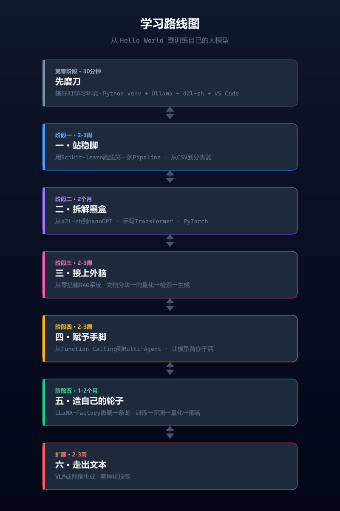

# （零）先磨刀：30分钟搭好你的AI学习环境

> 在跑通第一个模型之前，你只需要做好这四件事

---



## 系列速览

这个系列的目标读者是你——有 Python 基础、想做 AI/大模型方向、但不知道从哪开始的在校学生。

**全系列 7 篇，分 7 个阶段：**

| 阶段 | 标题 | 学会什么 | 需要 GPU？ |
|------|------|---------|-----------|
| 零 | 先磨刀 | 搭好 AI 学习环境（正在看这篇） | 否 |
| 一 | 站稳脚 | 用 Scikit-learn 跑通 ML Pipeline | 否 |
| 二 | 拆解黑盒 | d2l-zh + nanoGPT，搞懂 Transformer | 否（训练建议有） |
| 三 | 接上外脑 | 从零搭建 RAG 文档问答系统 | 否 |
| 四 | 赋予手脚 | Function Calling + Agent，让模型替你干活 | 否 |
| 五 | 造自己的轮子 | LLaMA-Factory 微调 7B 模型 | **需要** (3060+) |
| 六 | 走出文本 | VLM 或图像生成入门 | 选学 |

**硬件要求**：第零到四篇完全不需要 GPU。第五篇微调需要 RTX 3060 (12GB) 以上，或者用 Google Colab 免费 T4。

**怎么读**：按零到五的顺序读。第六篇可选。每篇文末有常见问题折叠块，卡住先展开看看。

---

一年前我干过一件蠢事：决定学大模型，打开搜索引擎，输入"怎么学AI"，然后把前20条结果里的教程全部收藏了。接下来三天，我在装CUDA、装TensorFlow、装Anaconda、装完又卸载之间反复横跳。第四天，我还没跑过一行模型代码。

这不是个例。大多数说"我在学AI"的人，第一个月花在了收藏教程和解决环境问题上。

这篇不做清单——做完下面四件事，你就有了一套能直接用30分钟的学习环境。

---

## 一、装Python，但别用你电脑上那个

你可能已经有Python了。别用那个。系统自带的Python被一堆软件依赖着，你装错一个包可能导致整个系统出问题。

正确的做法是用 `venv` 或者 `conda` 创建一个隔离环境。这样你装什么都不会影响到系统。

如果你还没装Python 3.11+：

```
# Windows: 去 python.org 下载安装包，装的时候勾上 Add to PATH
# Mac: brew install python@3.11
# Linux: sudo apt install python3.11 python3.11-venv
```

然后创建一个学习专用的虚拟环境：

```
python -m venv ai-env
source ai-env/bin/activate   # Mac/Linux
ai-env\Scripts\activate      # Windows
```

你的终端前面会出现一个 `(ai-env)` 前缀。这就对了。以后所有跟AI相关的包都装在这里面，不会和系统的其他Python打架。

**验证是否成功**：

```
(ai-env) $ python --version
Python 3.11.x
(ai-env) $ pip list
Package    Version
---------- -------
pip        xx.x.x
```

**常见问题**：如果在 Mac/Linux 上 `source` 报错 `No such file`，检查你装 Python 时有没有把 `python3.11` 加入 PATH。如果 Windows 上激活失败，尝试用管理员身份打开 PowerShell 并先执行 `Set-ExecutionPolicy Unrestricted -Scope Process`。

这一步花5分钟，能帮你省掉未来几十个小时的包冲突排查时间。

---

## 二、跑通第一个大模型

这里有个反常识的建议：在你读懂Transformer论文之前，先跑通一个模型。

不是为了学会什么，是为了获得正反馈。"模型在我电脑上跑起来了"这个体验本身，比你收藏100篇教程更有用。

装 [Ollama](https://ollama.com)。它是目前最友好的本地模型管理工具，没有之一。

```
# Mac/Linux: curl -fsSL https://ollama.com/install.sh | sh
# Windows: 去 ollama.com 下载安装包
```

装好后打开终端，执行：

```
ollama run qwen2.5:7b
```

**第一次运行会下载模型**，你会看到类似这样的输出：

```
pulling manifest
pulling d0d5025e5ee3... 100% ▕████████████████████▏ 4.0 GB/4.0 GB  12 MB/s  5m20s
pulling d0d5025e5ee3... 100% ▕████████████████████▏ 4.0 GB/4.0 GB  12 MB/s  0s
pulling 9f438cb9e0c3... 100% ▕████████████████████▏  341 MB/341 MB  11 MB/s  30s
pulling 5b0a7ac92b0f... 100% ▕████████████████████▏   201 B/201 B  11 MB/s  0s
verifying sha256 digest
writing manifest
removing any unused layers
success
```

等下载完成后，终端会进入对话模式：

```
>>> 你好，帮我写一段 Python 代码，计算斐波那契数列
```

模型会逐字输出回答。就这么简单。第一次看到模型在你自己电脑上逐字生成回答的时候，你会有一种"我真的在搞AI了"的感觉。

**如果下载慢**：qwen2.5:7b 有 4GB 左右。国内用户可以配置代理或使用 [hf-mirror.com](https://hf-mirror.com) 镜像站下载，或者到 [ModelScope](https://modelscope.cn) 下载，或者换更小的模型，比如 `qwen2.5:1.5b`（不到 1GB）：

```
ollama run qwen2.5:1.5b   # 先跑通流程
ollama run qwen2.5:7b     # 有余力再下大的
```

**如果报错 `Error: model requires more system memory`**：你的电脑内存不够跑 7B 模型，用 `qwen2.5:1.5b` 替代。

**如果终端里没有 `ollama` 命令**：Mac/Linux 试试重新开一个终端窗口。Windows 检查系统 PATH 里有没有 Ollama 的安装目录。

以后你可以随时 `ollama pull` 其他模型来切换——Llama、Mistral、DeepSeek，一行命令的事。

---

## 三、把一本教科书克隆到本地

你接下来真正要学的东西，大部分都在《动手学深度学习》（d2l-zh）里。现在先不读，把它克隆到你电脑上：

```
git clone https://github.com/d2l-ai/d2l-zh.git
cd d2l-zh
pip install -r requirements.txt
jupyter notebook
```

浏览器会自动打开，你会看到几十个 `.ipynb` 文件。随便点开一个，你就能在浏览器里运行代码、看公式、改参数。

不需要现在就去学它。你只需要知道它在你电脑上，任何时候你打开都能用。这种"拥有感"会降低你正式开始学习的心理门槛。

如果你没有装 Git：

```
# Windows: git-scm.com 下载安装
# Mac: brew install git
# Linux: sudo apt install git
```

只用学会三个命令：`git clone`（下载项目）、`git pull`（更新项目）、`git status`（查看状态）。这三个够你用一两年。

---

## 四、把开发环境收拾好

你会花大量时间在Jupyter Notebook和VS Code里。把这两个工具配置好，能直接影响你能坚持多久。

VS Code装这几个插件就够了，装多了反而卡：

- **Python**（微软官方那个）
- **Jupyter**（在VS Code里直接打开和编辑 `.ipynb` 文件）
- **GitLens**（看代码谁写的、什么时候改的）

然后在VS Code的设置里搜 `format on save` 并打开——以后每次保存代码自动格式化，缩进不一致这种低级错误不会再犯。

---

## 收工：你现在有什么

30分钟后的你：

1. 一个隔离的Python环境，随便装包不担心搞坏系统
2. 一个在本地运行的大模型，可以随时聊天
3. 一本近2000页的深度学习教科书在你硬盘上
4. 一个配置好的编辑器，写代码、跑Notebook都顺手

以上四件事，每件花5-10分钟，做完你就有了一套可用的AI学习基础设施。

下一篇文章，我们会用Scikit-learn跑通第一个完整的机器学习项目——不是装框架、不是配环境，是真正地从CSV文件到训练出一个能用的分类器。

---

<details>
<summary><b>常见问题</b></summary>

**Q: `python3.11` 命令找不到？**
A: 检查是否已安装 Python 3.11。Mac 用 `brew list python@3.11`，Linux 用 `which python3.11`。如果装了还是找不到，尝试用 `python3` 代替 `python3.11`——系统可能默认装了更高版本。

**Q: `pip install -r requirements.txt` 报错？**
A: 先激活虚拟环境（确保终端有 `(ai-env)` 前缀）。如果还是报错，试试逐行安装：`pip install jupyter matplotlib numpy pandas`。个别包冲突不影响核心功能。

**Q: Ollama 下载到一半断了？**
A: 重新运行 `ollama run qwen2.5:7b`，它会断点续传。如果反复断，换 `ollama run qwen2.5:1.5b`（文件小很多）。

**Q: Git 报 `Permission denied`？**
A: 你在 HTTPS 方式下可能没有配置认证。先运行 `git clone https://github.com/d2l-ai/d2l-zh.git`（不需要登录），如果还不行，检查网络代理设置。

**Q: VS Code 里 Jupyter Notebook 打不开？**
A: 装了 Jupyter 插件后，需要装 Python 内核。在 VS Code 里按 `Ctrl+Shift+P`，输入 `Python: Select Interpreter`，选你刚创建的虚拟环境 `ai-env`。

</details>
