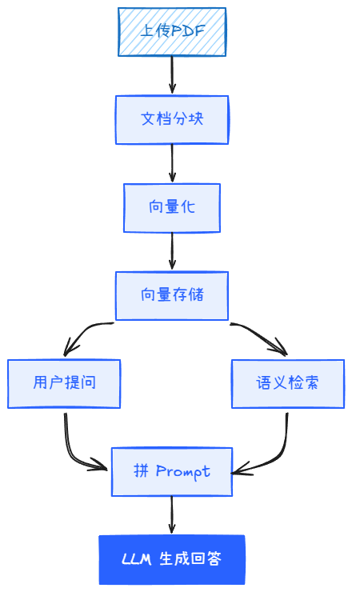

# （三）接上外脑：从零搭建RAG系统

> 让大模型读懂你的私人文档

---

上一篇文章，你跑通了nanoGPT。你看着loss从4.0降到了1.5左右，生成的莎士比亚风格文本虽然没规律但至少像英语。你懂Transformer了。

然后你把自己的实验报告喂给它，问"我的实验结论是什么"。它开始写莎士比亚风格的废话。

这就到了Transformer的死穴：它只知道训练数据截止日期前的东西。当你问一个关于你自己的文档的问题，它不可能知道答案，因为它在训练时从没见过这篇文档。能解决这个问题的技术叫RAG（Retrieval-Augmented Generation），中文叫检索增强生成。

这篇不做理论长篇大论——我们从零搭一个能用的RAG系统。

---

## RAG在做什么

一张图解释RAG的工作流：



核心思路不复杂：把你的文档切成块 → 转成向量 → 存起来 → 用户提问时，把问题也转成向量 → 找到最相似的文档块 → 把文档块拼到Prompt里喂给LLM。模型看起来"读"了你的文档。

---

## 动手搭：核心代码不到40行

用 [rag-from-scratch](https://github.com/langchain-ai/rag-from-scratch) 的思路，只依赖最底层的工具库，不套上层框架：

```
from sentence_transformers import SentenceTransformer
import chromadb
import os

with open("你的文档.txt", "r", encoding="utf-8") as f:
    doc = f.read()

# 1. 文档分块（每块 500 字符）
chunks = [doc[i:i+500] for i in range(0, len(doc), 500)]

# 2. 向量化
model = SentenceTransformer('BAAI/bge-small-zh-v1.5')
embeddings = model.encode(chunks).tolist()

# 3. 存入 ChromaDB
client = chromadb.Client()
collection = client.create_collection(name="my_docs")
collection.add(
    ids=[str(i) for i in range(len(chunks))],
    embeddings=embeddings,
    documents=chunks
)

# 4. 检索
query = "你的问题是什么"
query_emb = model.encode([query]).tolist()
results = collection.query(query_embeddings=query_emb, n_results=3)
```

四条注释，四个步骤，不到20行代码。这就是RAG的核心骨架。

**然后你拿到检索结果后，把它们拼进Prompt**：

```
prompt = f"""
基于以下文档内容回答问题。如果文档中没有相关信息，说"文档中找不到"。

文档内容：
{results['documents']}

问题：{query}

回答：
"""
```

把这整个Prompt发给Ollama或任何LLM的API，你会得到一个基于你自己文档的回答。
调用 LLM 的代码非常简单：

```
from openai import OpenAI

client = OpenAI(base_url="http://localhost:11434/v1", api_key="ollama")
# 替换为你的模型名
response = client.chat.completions.create(
    model="qwen2.5:7b",
    messages=[{"role": "user", "content": prompt}]
)
print(response.choices[0].message.content)
```

以下是某次实际运行的结果。用一篇国务院新闻稿作为文档，提问：

```
query = "第二十次专题学习的主题是什么"
```

检索到的相关片段（top-1 距离 0.93）中包含：

```
6月15日，国务院以"强化主体功能区战略实施，促进区域协调发展"为主题，
进行第二十次专题学习...
```

LLM 的回答：

```
第二十次专题学习的主题是"强化主体功能区战略实施，促进区域协调发展"。
```


---

## 几个关键参数

上面那段代码能在5分钟内跑通，但要让它真正好用，有四个地方值得花时间调：

**分块方式**：按500字符硬切会有问题——可能把一个完整段落从中间切断。更好的方案是按段落切（`split("\n\n")`），或者用LangChain的 `RecursiveCharacterTextSplitter`，它会尽量在自然边界（段落 → 句子 → 字符）处断开。

**Embedding模型选择**：`bge-small-zh-v1.5` 是BAAI（北京智源）的中文Embedding模型，对中文文档效果不错。如果用英文文档，换成 `all-MiniLM-L6-v2`。Embedding模型决定了"语义相似"的准确度——比向量数据库的选择影响更大。

**检索数量**：`n_results=3` 意味着只取最相似的3个文档块拼进Prompt。太多了会超过模型上下文窗口，太少了可能漏掉关键信息。3-5是一个经验上比较安全的范围。

**评估**：搭完RAG后你会觉得"效果好像还行"。不要凭感觉。[Ragas](https://github.com/explodinggradients/ragas) 可以自动计算Faithfulness（模型回答是否忠于原文）和Context Precision（检索是否精准）等指标。准备20个问答对，一行命令跑完评测，你会发现自己"感觉还行"的那些回答，在Faithfulness上可能只有0.6。

```
from ragas import evaluate
from ragas.metrics import faithfulness, answer_relevancy

# 这是示意代码，需要准备你自己的测试数据集
# dataset 应包含 question、answer、contexts 三个字段
scores = evaluate(dataset)
print(scores.to_pandas())
```

---

## 什么时候用框架

RAG的底层逻辑你理解了，上面那段代码够你做一个毕业设计。但如果要做产品级系统，有几个痛点需要专门工具来解决：

- **文档格式复杂**：PDF里的表格、图片、分栏排版 → 用 [RAGFlow](https://github.com/infiniflow/ragflow)，它的文档解析层专门处理这些场景
- **需要索引多种数据源**：网页、数据库、API → 用 [LlamaIndex](https://github.com/run-llama/llama_index)，它对"数据 → LLM"这个链路的抽象做得最到位
- **需要记忆、多轮对话、工具调用**：RAG变成Agent → 进入下一篇文章的范畴

一个实用的判断标准：如果你只需要"让模型回答关于我文档的问题"，上面那段代码+ChromaDB就够了。如果你需要"让模型回答关于我50种不同格式的文档的问题"，用RAGFlow。

---

## 参考项目

| 项目 | 作用 |
|------|------|
| [rag-from-scratch](https://github.com/langchain-ai/rag-from-scratch) | 核心教程：理解RAG每一行代码的含义 |
| [ChromaDB](https://github.com/chroma-core/chroma) | 向量数据库入门：一排pip install就能用 |
| [Ragas](https://github.com/explodinggradients/ragas) | RAG评测：你必须有量化指标，不能"感觉还行" |
| [RAGFlow](https://github.com/infiniflow/ragflow) | 生产级替代：多格式文档支持，带Web UI |

四个项目够用了。先跑通rag-from-scratch的代码，把上面的40行核心逻辑写一遍，然后用Ragas测一测。整个流程做完，你对RAG的理解就到位了。

---

## 这篇之后

你有了一个能"读"你的文档并回答问题的系统。但你很快会碰到它的天花板：它只能被动回答问题。你不能让它"帮我把这些数据做个汇总表发邮件给导师"——因为RAG没有"做"的能力。

让模型从"读"变成"做"，就是智能体（Agent）的范畴了。

---

> 本系列 Notebook 及配套文章：[github.com/ASPIRINH/hands-on-llm](https://github.com/ASPIRINH/hands-on-llm)

---

<details>
<summary><b>常见问题</b></summary>

**Q: `pip install chromadb` 报错？**
A: ChromaDB 依赖 `hnswlib`，Windows 上可能需要安装 C++ 构建工具。去 visualstudio.microsoft.com/visual-cpp-build-tools/ 装 "MSVC v143" 和 "Windows 10 SDK"。或者用纯 Python 替代方案：`pip install faiss-cpu`（FAISS 不需要编译）。

**Q: `SentenceTransformer` 下载模型很慢？**
A: 模型文件约 100MB，国内网络可能慢。先浏览器打开 HuggingFace 镜像站 `hf-mirror.com/BAAI/bge-small-zh-v1.5` 手动下载，然后把模型路径传给 `SentenceTransformer('/path/to/model')`。或者设置镜像：`export HF_ENDPOINT=https://hf-mirror.com`。

**Q: `collection.query` 返回空结果？**
A: 检查 chunks 是否为空（`print(len(chunks))`）。如果文档太短（少于 500 字符），分块后可能只有 1 块，检索时 n_results=3 会报错。把 min(n_results, len(chunks)) 传进去。

**Q: 检索结果和问题完全无关？**
A: 两个最常见原因：1) Embedding 模型是英文的但文档是中文（或反过来），检查 model 名称；2) 分块太小导致语义不完整，把块大小从 500 增加到 800。

**Q: Ragas 评测时 LLM 调用报错？**
A: Ragas 默认用 OpenAI API。如果你用本地模型，需要配置 `os.environ["RAGAS_LLM"]` 指向你的 Ollama 或其他 API 端点。参考 Ragas 文档的 "Custom LLM" 章节。

</details>
